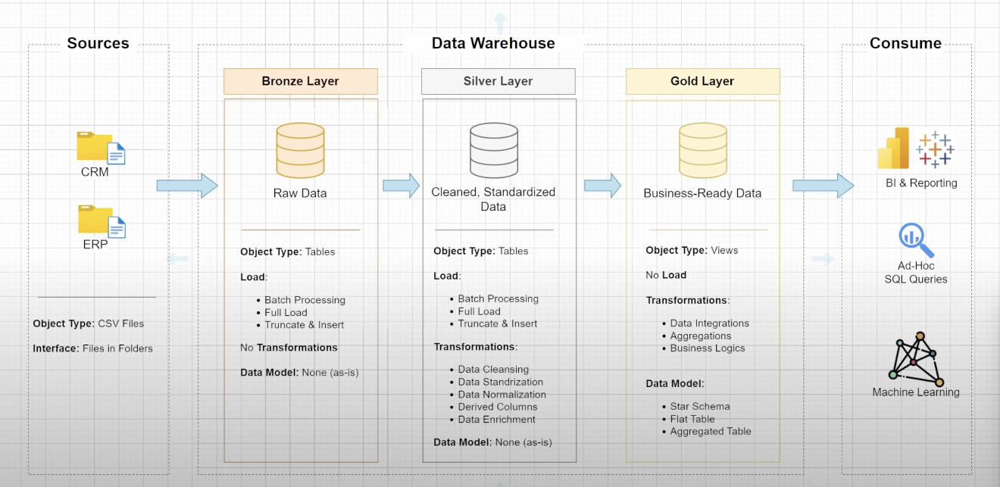
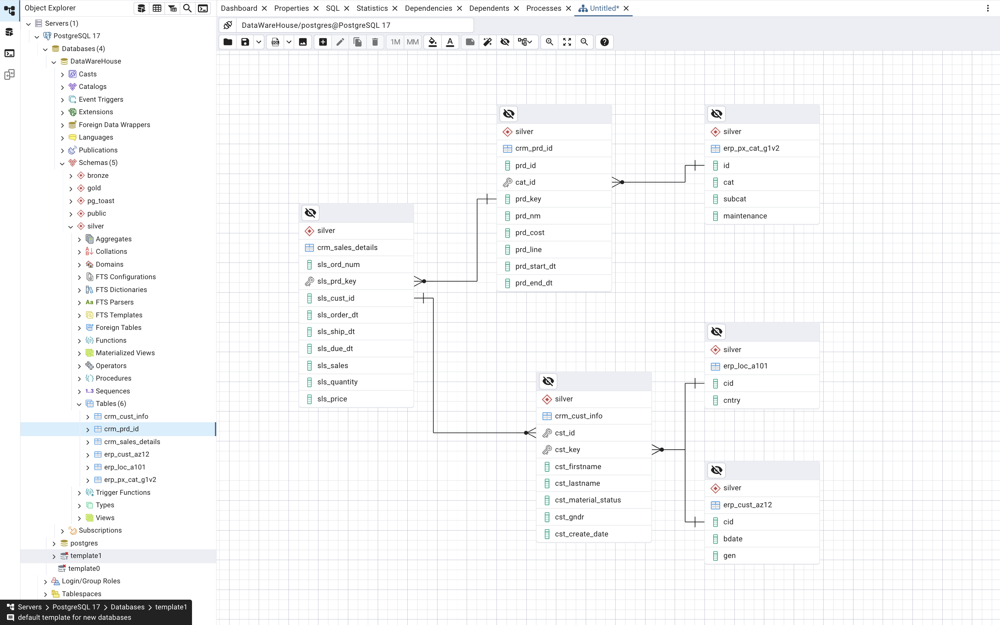

# Medallion-Data-Warehouse-Architecture Project

Welcome to the **Medallion-Data-Warehouse-Architecture Project** repository! 🚀  
This project demonstrates a comprehensive data warehousing and analytics solution, from building a data warehouse. 
---
## 🏗️ Data Architecture

The data architecture for this project follows Medallion Architecture **Bronze**, **Silver**, and **Gold** layers:


1. **Bronze Layer**: Stores raw data as-is from the source systems. Data is ingested from CSV Files into Postgresql Server Database.
2. **Silver Layer**: This layer includes data cleansing, standardization, and normalization processes to prepare data for analysis.
3. **Gold Layer**: Houses business-ready data modeled into a star schema required for reporting and analytics.

---
## 📖 Project Overview

This project involves:

1. **Data Architecture**: Designing a Modern Data Warehouse Using Medallion Architecture **Bronze**, **Silver**, and **Gold** layers.
2. **ETL Pipelines**: Extracting, transforming, and loading data from source systems into the warehouse.
3. **Data Modeling**: Developing fact and dimension tables optimized for analytical queries.
4. **Analytics & Reporting**: Creating SQL-based reports and dashboards for actionable insights.

🎯 This project involves topics as:
- SQL Development
- Data Architect
- Data Engineering  
- ETL Pipeline Developer  
- Data Modeling  
   

---
##Data Modeling - In this project we have total 6 table contatining customers and product informations. 
The data architecture for this project follows Star schema:



##🏗️ Data Flow Across Layers – From Raw to Insight
The image showcases the end-to-end data pipeline that takes raw data through a structured process of transformation and modeling. Let's break it down layer by layer:

🧱 1. Raw Layer (Landing Zone)
- This is the initial stage where raw data lands directly from the source systems.

- Data can come from different sources such as databases, APIs, logs, or files (CSV, JSON, etc.).

- No transformations are applied here – it's untouched data, used as a source of truth.


🔄 2. Staging Layer
- Here, SQL queries are used to clean and prepare the raw data.

- Basic transformations occur: fixing nulls, standardizing formats, filtering unnecessary records, etc.

- This stage acts as a preparation zone, making the data consistent and ready for analysis.


📊 3. EDA Layer (Exploratory Data Analysis)
- In this layer, data analysts and engineers use EDA techniques to explore trends, patterns, and anomalies.

- Helps identify relationships, validate assumptions, and check data quality.

- Common tools: SQL, Python (Pandas, Matplotlib), and notebooks.

🧩 4. Modeling Layer (Star Schema)
- Data is now structured into Fact and Dimension Tables, forming a dimensional model:

- Fact Tables contain measurable, quantitative data (e.g., Sales Amount).

- Dimension Tables hold descriptive data (e.g., Product, Customer, Time).

- This star schema design improves query performance and makes it easier for reporting tools (like Power BI, Tableau) to consume.

- The goal is to enable business intelligence and reporting with a user-friendly schema.

✅ Summary of the Flow
Raw – untouched data.

Staging – cleaned and standardized using SQL.

EDA – explore and validate data insights.

Modeling – build fact/dimension tables for analytics.


---

## 🚀 Project Requirements

### Building the Data Warehouse (Data Engineering)

#### Objective
Develop a modern data warehouse using PGAdmin4 Server to consolidate sales data, enabling analytical reporting and informed decision-making.

#### Specifications
- **Data Sources**: Import data from two source systems (ERP and CRM) provided as CSV files.
- **Data Quality**: Cleanse and resolve data quality issues prior to analysis.
- **Integration**: Combine both sources into a single, user-friendly data model designed for analytical queries.
- **Scope**: Focus on the latest dataset only; historization of data is not required.
- **Documentation**: Provide clear documentation of the data model to support both business stakeholders and analytics teams.

---


## 📂 Repository Structure
```
data-warehouse-project/
│
├── datasets/                           # Raw datasets used for the project (ERP and CRM data)
│
│── scripts/                            # SQL scripts for ETL and transformations
│   ├── bronze/                         # Scripts for extracting and loading raw data
│   ├── silver/                         # Scripts for cleaning and transforming data
│   ├── gold/                           # Scripts for creating analytical models
│
├── tests/                              # Test scripts and quality files
│
├── README.md                           # Project overview and instructions
├── LICENSE                             # License information for the repository
                          
```
---

---

## 🛡️ License

This project is licensed under the [MIT License]. You are free to use, modify, and share this project with proper attribution.

## 🌟 About Me

Hi there! I'm Chetan Daharwal 👋

I'm a passionate data enthusiast, continuously sharpening my skills in the world of data engineering. With a strong interest in building robust data pipelines and scalable solutions, I’m always exploring modern tools and technologies that power data-driven decision-making.


🎓 B.Tech in Data Science & AI

⚙️ Skilled in Python, SQL, Azure Data Factory, and Databricks

🧠 Focused on Big Data and Cloud-based Data Engineering

🛠️ Currently exploring modern data architecture (Bronze-Silver-Gold layers)

📈 Interested in building efficient ETL pipelines and real-time analytics

Let’s connect, collaborate, and contribute to the world of data! 🌍✨


